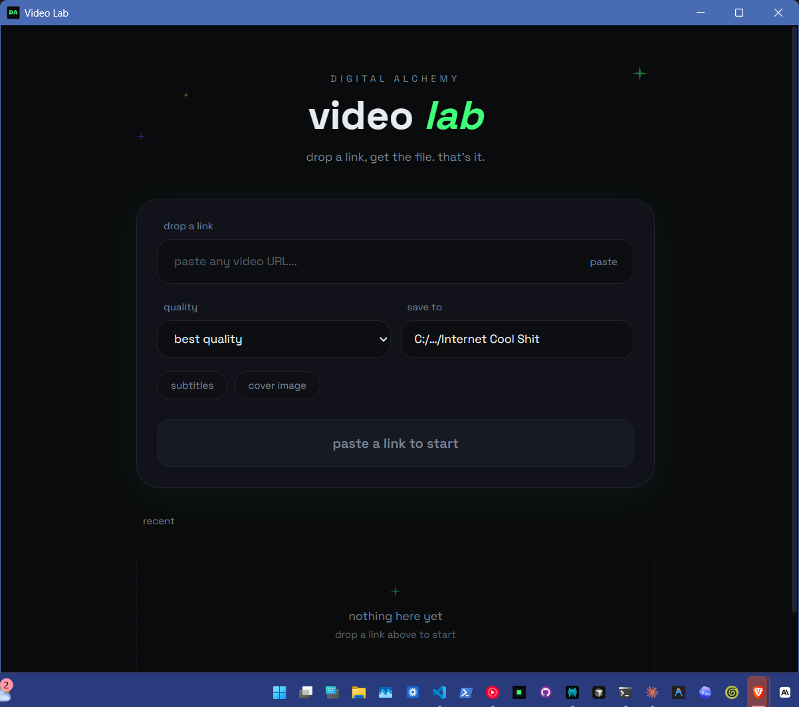

# Video Lab

> A no-bullshit desktop video downloader for Windows. Paste a link from YouTube, TikTok, Vimeo, X, Instagram, Twitch, or 1000+ other sites — get the file.
>
> Built by [Desi Baker](https://beacons.ai/dbcreations) with vibe coding (Tauri + React + Rust) for the [Digital Alchemy Academy](https://beacons.ai/dbcreations) community.



---

## What it does

- Downloads from any site `yt-dlp` supports (YouTube, Vimeo, TikTok, Twitter/X, Instagram, Twitch, 1000+ more)
- MP4 video up to 4K, or rip audio as MP3
- Playlist mode — paste a playlist URL, pick the videos you want with checkboxes
- Embeds subtitles and thumbnails automatically (toggleable)
- Sequential download queue — fire off 20 jobs, walk away
- `yt-dlp` and `ffmpeg` are bundled inside the installer — nothing else to install

---

## Install

### The vibe-coder install path (recommended)

If you're using **Claude Code, Cursor, Codex, Windsurf, Aider**, or any AI dev environment — let your AI verify the code is safe AND walk you through the install. This is the same move you should make for any open-source software a stranger on the internet hands you, including this one.

Paste this prompt into your AI:

```
Look at this repo: https://github.com/jackdog668/da-video-tool

Read the README, the LICENSE, the package.json, src/App.tsx,
src-tauri/src/lib.rs, src-tauri/Cargo.toml, src-tauri/tauri.conf.json,
and scripts/fetch-binaries.ps1.

Tell me:
1. What does this app actually do?
2. Is the code safe to run? Any red flags (data exfiltration, network
   calls to weird servers, anything that touches files outside what
   you'd expect for a video downloader)?
3. What external binaries does it bundle and where do they come from?
4. Walk me through downloading the latest release installer from
   https://github.com/jackdog668/da-video-tool/releases/latest
   and installing it on Windows. Include the SmartScreen step.
```

Don't trust — verify. Your AI is your security partner.

### The quick install path

Grab the installer from [Releases](https://github.com/jackdog668/da-video-tool/releases/latest):

```
Video.Lab_0.1.0_x64-setup.exe   (~62MB)
```

Double-click → next next finish → done.

**First run:** Windows SmartScreen will warn *"Unrecognized app"* because I haven't paid Microsoft $300/yr for a code-signing cert. Click **More info → Run anyway**. The app's not malware, just unsigned. Verify the SHA256 in [SKOOL_DROP.md](SKOOL_DROP.md) if you want receipts.

---

## Build from source (for devs / vibe coders)

You'll need:

- Node.js 20+ and npm
- Rust (install via [rustup.rs](https://rustup.rs))
- The Tauri prerequisites for your OS — see [Tauri's setup guide](https://tauri.app/start/prerequisites/)
- Windows 10/11 (the bundled binaries are Windows-only x86_64; for other platforms you'd need to swap them)

Then:

```bash
git clone https://github.com/jackdog668/da-video-tool.git
cd da-video-tool

# Pull yt-dlp and ffmpeg into src-tauri/binaries/
# (gitignored because ffmpeg.exe is 184MB and would exceed GitHub's file limit)
powershell -ExecutionPolicy Bypass -File .\scripts\fetch-binaries.ps1

npm install
npm run tauri dev    # run in dev mode
npm run tauri build  # produce installers in src-tauri/target/release/bundle/
```

---

## Stack

- **[Tauri 2](https://tauri.app)** — Rust shell, Webview frontend, native installer
- **React 19 + TypeScript + Vite 7** — frontend
- **Tailwind CSS v4** — styling
- **[yt-dlp](https://github.com/yt-dlp/yt-dlp)** — the actual download engine (Unlicense, bundled as sidecar)
- **[ffmpeg](https://ffmpeg.org)** — muxing, format conversion, audio extraction (LGPL build from [gyan.dev](https://www.gyan.dev/ffmpeg/builds/), bundled as sidecar)

---

## License

The code in this repo is licensed under the **MIT License** (see [LICENSE](LICENSE)).

The bundled `yt-dlp` and `ffmpeg` binaries carry their own licenses:
- `yt-dlp` — [Unlicense](https://github.com/yt-dlp/yt-dlp/blob/master/LICENSE)
- `ffmpeg` — [LGPL v2.1+](https://ffmpeg.org/legal.html) (essentials build from gyan.dev)

**Use this app for personal and educational purposes only. Respect creators. Don't redistribute downloads.**

---

## Built in public

This is one of 100 apps I'm shipping as part of the [Digital Alchemy Academy](https://beacons.ai/dbcreations) curriculum on teaching creative professionals to build real apps with AI assistance.

Watch the build live on Twitch, ask questions in [the Skool community](https://beacons.ai/dbcreations), or just rip the source and remix it.

— Desi
